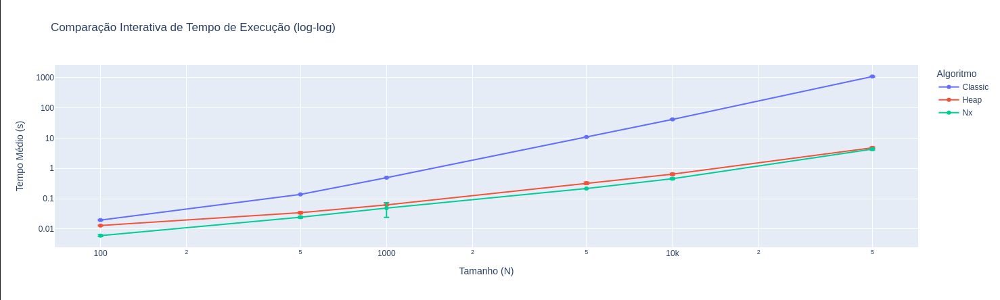

# Comparação de Performance: Dijkstra Clássico vs Dijkstra com Min-Heap

## 👥 Equipe
- Jucinara Melo  
- Pablo Arthur 

---

## 🎥 Vídeo de Apresentação

https://drive.google.com/drive/folders/1Dfvt7NUSsrxeGKc637IvF03N37PEMxV2?usp=sharing

---

## 🎯 Objetivo do Projeto
Este projeto tem como objetivo avaliar o tempo de execução e a pegada de carbono (CO₂) das seguintes abordagens de cálculo de caminho mínimo em grafos:

- Dijkstra Clássico — Complexidade: O(V² + E)
- Dijkstra com Min-Heap — Complexidade: O((V + E) * log V)
- Função de referência do NetworkX — Implementação otimizada disponível na biblioteca

---

## ⚙️ Metodologia

Para cada tamanho de grafo, foram gerados grafos ponderados e conectados usando o networkx, e escolhidos 5 nós aleatórios como fontes de cálculo.
Para cada um desses nós, o caminho mínimo até todos os outros nós foi calculado usando as três abordagens:
   
1. Dijkstra Clássico

2. Dijkstra com Min-Heap

3. Implementação do NetworkX

Durante cada execução, foram registradas as seguintes métricas:
- ⏱ **Tempo de execução (s)** — medido para avaliar o desempenho de cada abordagem.  
- 🌱 **Pegada de carbono (kg CO₂e)** — estimada com a biblioteca **CodeCarbon**, considerando o consumo energético durante a execução.

### Etapas do Experimento

1. **Geração dos Grafos:**  
   Foram criados grafos de diferentes tamanhos: **100, 500, 1k, 5k, 10k, 50k**.  

2. **Execução dos Algoritmos:**  
   Cada algoritmo foi executado 15 vezes sobre os mesmos grafos, calculando-se a média das métricas coletadas.  

3. **Coleta e Análise das Métricas:**  
   - Tempo médio de execução (s).  
   - Emissão média de CO₂ (kg).  

4. **Visualização dos Resultados:**  
   Os dados foram representados em **gráficos comparativos no formato log-log**, destacando o comportamento dos algoritmos em diferentes escalas.

---

## 🔍 Explicação dos Algoritmos

### **Dijkstra (Classic)**
A versão clássica de Dijkstra busca o menor caminho de um vértice origem até todos os outros vértices em um grafo ponderado.
Na versão clássica, é utilizada uma busca sequencial para encontrar o vértice de menor distância ainda não visitado — o que leva a uma complexidade de O(V²).

### **Dijkstra (Heap)**
Nesta versão, a estrutura de dados Min-Heap (fila de prioridade) é utilizada para otimizar a busca pelo menor caminho.
Isso reduz a complexidade para O((V + E) * log V), tornando a execução muito mais eficiente em grafos grandes.

### **Dijkstra (Nx)**
Implementação utilizando a função nativa do **NetworkX**, que é altamente otimizada internamente, combinando eficiência e facilidade de uso, sua complexidade é de O((V + E) * log V).

---

## 📊 Resultados e Análises

### 🕒 Comparação de Tempo de Execução

**Gráfico 1** — Comparação Interativa de Tempo de Execução (log-log)
Mostra a variação do tempo médio em função do tamanho dos grafos.

  

📈 **Análise:**

O gráfico acima mostra que a versão **Classic** apresenta um crescimento exponencial no tempo conforme o tamanho do grafo aumenta, devido à sua complexidade quadrática.  
Já as versões com **Min-Heap** e **NetworkX** mantiveram desempenho semelhante e bem superior, crescendo quase linearmente em escala log-log.

### 🌱 Comparação de Emissão de CO₂

**Gráfico 2** — Comparação Interativa de Emissão de CO₂ (log-log)
Mostra o consumo energético estimado para cada algoritmo conforme o tamanho do grafo aumenta.

📉 **Análise:**  

A emissão de CO₂ segue o mesmo padrão do tempo de execução, já que está diretamente relacionada ao uso de CPU.
O Dijkstra **Clássico** teve as maiores emissões, proporcionalmente ao seu tempo de processamento.
O **Min-Heap** e o **NetworkX** foram mais sustentáveis, consumindo menos energia e, consequentemente, emitindo menos CO₂.

---

## 💬 Considerações Finais 
Os experimentos demonstraram que:
- O **Dijkstra Classic** é adequado apenas para grafos pequenos.  
- O **Heap** apresenta excelente equilíbrio entre desempenho e implementação.  
- O **Nx (NetworkX)** é uma ótima alternativa quando se deseja simplicidade e bom desempenho, aproveitando otimizações internas da biblioteca.  

Além disso, observou-se que otimizar algoritmos não apenas reduz o tempo de execução, mas também **minimiza o consumo energético e as emissões de carbono**.

---

## ✨ Conclusão

O projeto comprova a importância de estruturas de dados eficientes como Min-Heap para problemas clássicos como o caminho mínimo.
Além disso, evidencia como otimizações de algoritmo reduzem também o impacto ambiental, reforçando a relevância de análises sustentáveis em computação.
